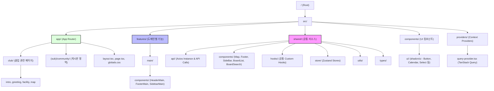

# UNI VALLEY CC - Next.js Project

고령유니밸리 컨트리 클럽 웹사이트 프로젝트입니다. Next.js 15와 App Router를 기반으로 고성능과 높은 유지보수성을 지향하는 아키텍처로 설계되었습니다.

## 🛠 Tech Stack

- **Framework**: Next.js 15 (App Router)
- **Language**: TypeScript
- **Styling**: Tailwind CSS, shadcn/ui
- **State Management**: Zustand
- **Data Fetching**: TanStack Query (React Query), Axios
- **Utility**: dayjs, date-fns
- **Icons**: Lucide React
- **Formatting**: ESLint, Prettier

---

## 🏗 Project Architecture

이 프로젝트는 **응집도(Cohesion)**를 높이고 **결합도(Coupling)**를 낮추기 위해 도메인 기반의 `features` 구조와 공통 리소스 기반의 `shared` 구조를 혼합하여 사용합니다.



---

## 📂 Directory Structure

- **`src/app`**: 페이지 라우팅 및 레이아웃 정의
- **`src/features`**: 특정 도메인(메인, 어드민 등)에 특화된 컴포넌트 및 로직
- **`src/shared`**: 프로젝트 전반에서 공유되는 API, 컴포넌트, 훅, 스토어 등
- **`src/components/ui`**: `shadcn/ui` 라이브러리를 통해 생성된 기초 UI 컴포넌트
- **`src/providers`**: 전역 상태 및 라이브러리 설정을 위한 Provider 모음

---

## 🚀 Getting Started

1. **의존성 설치**
   ```bash
   npm install
   ```

2. **개발 서버 실행**
   ```bash
   npm run dev
   ```

3. **빌드**
   ```bash
   npm run build
   ```

4. **린트 및 포맷팅**
   ```bash
   npm run lint   # 코드 린트 체크
   npm run format # Prettier 포맷팅 적용
   ```

---

## 📝 주요 구현 사항

- **Dynamic Navigation**: `next/navigation`을 활용한 검색 및 필터링 기능
- **Custom Calendar**: `shadcn/ui` Calendar와 `date-fns`를 조합한 한국어 지원 기간 선택기
- **Bento Grid Layout**: 메인 페이지 내 이미지 그리드 레이아웃 구현
- **API Interceptor**: Axios를 활용한 공통 요청/응답 처리 로직
